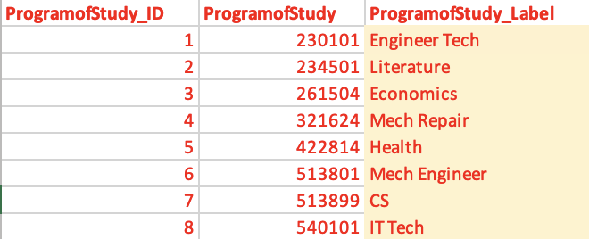

# The SDP PDP Extension Tool

This tool is an extension of Harvard's [Strategic Data Project (SDP)](https://sdp.cepr.harvard.edu/home) [CTE Diagnostic Toolkit](https://sdp.cepr.harvard.edu/sdp-cte-diagnostic-toolkit). 

It is developped for institutions that participate in the Postsecondary Data Partnership (PDP) to help them answer key questions on student success from the CTE Diagnostic, using their PDP [Analysis-Ready (AR) Files](https://help.studentclearinghouse.org/pdp/knowledge-base/using-the-analysis-ready-files). 

Specfically, this tool simplifies the data preparation process required for the CTE Diagnostic by leveraging the standardization of the AR files. This tool provides Stata code that transforms an institution's AR files into appropriate dataframes for the CTE Diagnostic analyses.

This tool also adds new dimensions to the analysis included in the original CTE Diagnostic by looking at student outcomes specific to the AR files, in particular short-term outcomes, to enrich institutions' understanding of their students' success.

This README.md document explains how this tool is structured, and provides step by step instructions on how to use it with your PDP data. The StepbyStepGuide.pdf is a hands-on complement to this README, with screenshots and detailed instructions on how to navigate this tool. 

The [ReportDemo.md](https://github.com/BeaLeydier/researched-pdp-toolkit/blob/main/ReportDemo.md) document serves as an example of the kind of graphs and analyses you can generate with this tool. The documentation of the [CTE Diagnostic Toolkit](https://sdp.cepr.harvard.edu/sdp-cte-diagnostic-toolkit), in particular the narrative and the technical guide, contain much more in-depth information on the content of the analyses you can generate with this tool, and how to interpret them with regards to your student's success. This tool and its documentation focuses mostly on how to implement these analyses using PDP data. It is recommended that you become familiar with the contents of the CTE Diagnostic before diving into this extension.

## Introduction

### Objective

This goal of this resource is to help institutions of higher education that participate in the Postsecondary Data Partnership (PDP) use their PDP [Analysis-Ready Files](https://help.studentclearinghouse.org/pdp/knowledge-base/using-the-analysis-ready-files) 
to answer new, program-level questions about postsecondary student success, particularly students moving through certificate and credentialing pathways in college, utilizing [SDP]((https://sdp.cepr.harvard.edu/home))’s [postsecondary CTE diagnostic toolkit]((https://sdp.cepr.harvard.edu/sdp-cte-diagnostic-toolkit)).  

### Background

The National Student Clearinghouse’s Postsecondary Data Partnership (PDP) offers important, interactive dashboards that enable institutions of higher education to visualize student outcomes in aggregated and disaggregated forms. The Strategic Data Project, in partnership with ResearchEd and with support from the Gates Foundation, has developed a tool to help institutions deepen the insights provided by the PDP and answer additional program-level questions about student success, drawing upon SDP’s postsecondary-focused CTE diagnostic code and analyses. 

This tool leverages the fact that the PDP AR files are standardized, making it very easy to adapt this tool's code to each institution and produce reports by plugging PDP data into the tool's code. This tool provides a simple starting point to leveraging your PDP AR file and produce new insights, beyond the PDP dashboards.

Using this tool you will be able to:
- Create easily customizable visuals and dig deeper into trends in student success in your institution. For example, the PDP’s AR files contain detailed information on short-term outcomes (year 2 persistence or retention), and you will be able to look at these dynamically by student pathway and other student characteristics.
- Build on descriptive analyses in the PDP dashboards by using regression models to adjust for student background characteristics. This allows institutions to account for factors outside of their locus of control and identify which factors contribute to student outcomes. These models make comparisons between cohorts, institutions, and programs a possibility for institutions participating in the PDP.
- Expand the focus of analyses to include program-of-study and pathways data in depth.

### How it Works

This tool contains code and instructions to
- transform your PDP Analysis-Ready Files into the appropriate data structure for our analysis purpose; we will call this step "Make Data"
- use these transformed datasets to create relevant graphs and tables featured in the [CTE Diagnostic Toolkit](https://sdp.cepr.harvard.edu/sdp-cte-diagnostic-toolkit); we will call this step "Make Report"

Given the PDP Analysis-Ready Files follow a standardized, predictable format, the code is meant to be as close to plug-and-play as possible. This readme provides instructions on how to set up the tool with your own data and parameters, and where to adjust the code if needed.

At the time of this writing the PDP Analysis Ready files do not contain information on student pathways, a core dimension of the CTE diagnostic. To address this, this tool includes a data entry step aimed at combining student pathway data with data from your PDP Analysis-Ready Files; we will call this step "Enter Data". This readme also provides instructions on how to enter and label your student pathway data before running the analyses.

## Contents: What kind of analyses and insights can I expect from this tool?

This repository contains an example of the graphs and tables generated by this tool in the [ReportDemo.md](https://github.com/BeaLeydier/researched-pdp-toolkit/blob/main/ReportDemo.md). The sections of the report mirror those of the CTE Diagnostic. It also adds a few dimensions for the analysis, leveraging the specificity and richness of the data available in the PDP Analysis-Ready Files.

Specifically, the sections are 

- **Section 0 : Describing Your Data**    
    This section corresponds to Section 0 in the SDP Diagnostic, though the original SDP Diagnostic did not include code files for this section. The current tool provides some example code for simple graphs you may want to generate to describe your data.

- **Section 1 : Completion** which contains two sub-sections
  - The Completion by Pathway subsection is analogous to Section 1 of the original SDP CTE Diagnostic, and focuses on student completion outcomes by pathway.
  - The Completion by Credential Sought subsection is an addition compared to the SDP CTE Diagnostic. It follows the same logic as the previous subsection, but analyzes data by credential sought instead of pathway, leveraging the fact that the PDP Analysis Ready files contain information on credential at entry.     

- **Section 2 : Mapping Student Progression** which contains two sub-sections
  - The Pathways Over Time subsection is analogous to the SDP diagnostic's Section 2, and looks at student outcomes by pathway over time. One key difference with the SDP diagnostic is that, because the PDP Analysis Ready Files contain year-level outcome data instead of term-level outcome data, the graphs in this unit display progression year by year, instead of term by term.
  - The Short-Term Outcomes subsection focuses on Year 2 outcomes available in the PDP Analysis-Ready Files : Retention and Persistence. It contains similar analyses as those in Section 1, but focused on these two short term outcomes, instead of final completion outcomes.

- **Section 3 : Gate-Keeper Courses**  
    This section is analogous to Section 3 in SDP's CTE Diagnostic, and looks at gate-keeper courses in each pathway.

- **Section 4 : Credit Accumulation**  
    This section is analogous to Section 4 in SDP's CTE Diagnostic, and looks at credit accumulation over time. 

## Getting Started: How do I get this tool?

If you are familiar with github, you can fork this repository, and clone it to your local machine.

If you are not familiar with github, you can simply download this repository, and save it anywhere convenient on your local machine. For that, click on the green "<> Code" button and select "Download ZIP". Then, navigate to the working directory on your local machine where you want this tool to be saved, and save the repository there. It will be saved as a .zip file, which is a compressed folder containing all the files and subfolders of this repository. You will need to [unzip](https://www.wikihow.com/Unzip-a-File) it.

Whether you fork/clone or download the repository, it is important to keep the folder and subfolder structure intact, as well as keep the existing files and folder names as they are. The code of the tool is written with those in mind, and modifying them will require more customization of the existing code before you can run it. While we strongly advise against deleting or renaming existing folders or files, you will need to add new files to the existing tool, inside the appropriate subfolders, as you start working on it.

## Workflow: How will this work ?

You will first download the tool and save its contents to your own machine, so you can run it on your own data.

You will then copy and save the following data files to your tool folder on your local machine, inside the dedicated subfolders of the tool 
- Your PDP Analysis Ready Files under `1_data-pdp`
- Your student pathway information under `2_data-toolkit`

The AR files are already standardized and formatted, and you can get help on how to find them [here](https://tinyurl.com/ARFILEPLEASE). 

The student pathway information is not standardized, and this tool contains scripts and templates to help you extract, format and label the student pathway information in a way that will make it easy to integrate it with the rest of the PDP data used in this tool. This tool also contains some diagnostics for you to run, checking for some possible discrepancies between your PDP AR files and the student pathway information you are providing. 

The set up and data definition steps will only be done once. From there onward, the analysis starts.

Once you have added your data to the appropriate subfolders, you can run the tool's analyses to create an analytical report. The analyses rely on certain parameters and custom choices that will be specific to your institution, which you can define once at the beginning of the analysis. These include for example defining whether you are a 2-year or a 4-year institution, and what colors you want to use for your graphs. For each of the parameters, the tool has defined a default, as well as instructions on how to change this default. You will be able to change these later as well if you want to produce different reports with different parameters.

Once you have defined your analysis parameters, you can run the dofiles (aka scripts) that produce the analyses. The first dofiles will transform, recode, reshape and restructure your data. The next dofiles use the transformed data to produce graphs and tables.

## Overview: How is this tool structured?

This tool contains files at the root of the repository, as well as subfolders with more files. 

At the root of the repository, we have 
- a `.gitignore` file : You can ignore (!) this file. It is the file that ensures in the background that none of the files you add in the 1_data-pdp, 2_data-toolkit, 3_data-diagnostics folders are getting tracked by git, so they are never shared with github. This means that any data that you use as part of this tool will only live locally on your machine, wherever you have saved your local folder. By using this tool you are not giving anyone else access to your data.
- some `master dofiles` : these master dofiles either set up your tool for the analysis, or call the other dofiles of the tool, to make it easy for you to run a whole portion of the tool without having to run each file separately. Each master dofile corresponds to one step you have to complete in the tool. The master dofiles also contain a lot of comments and instructions on what each step consists of.
- this `README.md` document
- a `StepbyStepGuide.pdf` document, which is a complement to the readme with screenshots and instructions on how to navigate this tool
- a `ReportDemo.md` document, which is an example report that this tool generates

The rest of the tool files are organized in subfolders as follows 

- `0_scripts` contains all of the scripts of the tool, including a custom `ado` subfolder where custom colors are defined for the tool graphs
- `1_data-pdp` is where you will add your PDP AR files 
- `2_data-toolkit` is where the pathway data entry templates will be saved, and where you will add your student pathway data
- `3_data-diagnostics` is where any data diagnostics you choose to run on the pathway data entry will get exported 
- `4_output` is where all the graphs and tables of the analysis will get exported

## Customization: What will you need to update before being able to run the code ?

While this tool is meant to be as plug-and-play as possible, you will need to customize it to make it fit your needs and your data. There are a few ways in which you will need to update and customize it. The pages 30 onward of the `StepbyStepGuide.pdf` include more details, with screenshots and specific instructions, on how to do each of these customizations.

1. Before working on the tool, you will need to run the `0.Set-Up` file that installs custom user written commands in Stata required for this tool
1. You will need to add your data (PDP and pathway data) in the appropriate subfolders, and
    - add your PDP data file name to the `1.1.Add-PDP-Data.do` dofile
    - add your pathway data and pathway label files name to the `2.3.Add-Pathway-Data.do` dofile
1. At the top of every dofile you run, you will need to define your machine-specific filepath, following the example provided in each dofile in the Set Up section of each dofile. More details on how to do this are included in the `0.Set-Up.do` dofile, as well as in the `StepbyStepGuide.pdf`.
1. Before running any analysis, you will need to define your institution's parameters, like whether you are a 2-year or 4-year institution in the dofile `3.Define-Institution-Parameters`.
1. Inside any dofile you run, you will need to update the code everywhere there is a comment that says **INSTRUCTIONS**. This may include updating a file name or a file path, changing a variable name, or other customizations.
1. Inside any dofile you run, you may need to make additional changes to the code if you run into any errors due to data types or file types being inconsistent. Each dofile contains ample documentation explaining what the code aims to do, as well as suggestions for checks and possible alternative code in case of common errors. 

## Step by Step : Using this Tool

All the steps 0 to 2 are done just once, before you can start transforming data and creating analyses. Steps 3 to 5 are the ones producing the analysis, once the tool is set and the data uploaded.

### Step 0. Set Up

Open and run the `0.0.Set-Up.do` dofile at the top of the repository to install some important Stata-specific commands. This step only needs to be done once, before anything else.

Start by adding your machine-specific file path at the top (like you will in every dofile), and you will be able to run the dofile.

The dofile does two things :

1. Installs the custom user-written commands you will need to run this tool. It is necessary for you to run this part of the dofile to ensure the rest of the tool runs smoothly.

1. Defines custom colors for the graphs. This section is only for your information and doesn't need to be run nor changed if you do not wish to change the default colors we have defined for the graphs.
        We have created dedicated color files (.style files), and saved them under the 0_scripts folder in an ado subfolder.
        This dofile adds the custom ado filepath to the ado filepaths recognized by your Stata, in order to add these custom colors to your Stata repertoire. That step is repeated in every dofile that exports a graph, to ensure the colors are always recognized by Stata locally.
        This file also prints the color palette in a graph for you to see the custom colors, as shown below. You can use this same graph exporting feature if creating your own custom color palette. 
        If you want to change these custom colors, we have included instructions in the dofile on how to update the .style files accordingly.
        If you do not need to change the custom colors, nothing is required for you to do in the style files.

### Step 1. Add PDP Data 

Find your PDP Analysis Ready (AR) Files, copy and save them under the `1_data-pdp` subfolder of this tool. For this tool, we are only using the AR Cohort file and the AR Course file, so you only need to copy these two in that folder. If you need help finding your PDP AR files, you can go [here](https://tinyurl.com/ARFILEPLEASE).

Once that is done, add your PDP AR file names to the `1.1.Add-PDP-Data.do` dofile, where the globals are being defined. It is important for these names to be updated at this stage, as the next dofiles (from step 2 onward) will refer to them. This dofile also contains a more detailed explanation of how globals work in Stata, and why adding the name of the file here will be useful for other scripts as well.

### Step 2. Add Pathway Data 

Unlike the rest of the PDP data, student pathway is not systematically entered on a year-by-year basis in the AR files. In order to run pathway-level analysis, you then need to add student pathway data to this tool. In order to make it easier, this tool creates two templates, based on your existing PDP data, to help you enter your pathway data as well as label pathways. 

Start by running the `2.1.Create-Pathway-Data-Entry-Template.do` dofile : this creates two templates, at the Year and the Term level, for you to enter student pathway data for all students present in your PDP AR files. The template looks like the image below. Note that the data presented in the image below is mock data. The Excel template created by this dofile shows you the format in which you should add the pathway data, and lists all the students for which you need to add them. You do not _have_ to use the Excel template generated by this dofile, but you need to provide a file with the student pathway information formatted in the same way and save it under `2_data-toolkit`.

We recommend entering pathway data at the year level, (when a student changes pathways within a year, you can choose whether to use the start of the year or the end of the year pathway as this year's pathway). This is because most student outcomes in the PDP AR files are defined at the year level and this tool only constructs student outcomes at the year level, allowing you to do year-level analysis. For any term-level analyses, more customization will be required from your end to create term-level outcomes from the PDP data or other data sources.

The template above is generated by the tool, listing all students present in your PDP data for each year they are listed, and adding a column for you to fill their program of study for each year. Even if you don’t use this template, you need to add a student pathway file which contains the 3 columns in red named and formatted the same way (StudentID, AcademicYear, ProgramofStudyYear_input). The other variables are added just for information. The ProgramofStudyYear_input variable should contain the program of study code of the pathway.

Once you have added your student pathway data file, open and run the `2.2.Create-Pathway-Labeling-Template.do` dofile : this creates a template for you to label your pathways, so that graphs do not display program codes but instead display recognizable pathway names. In order for this file to run, you will need to add the name of your student pathway data file (which you just created and added to `2_data-toolkit`) on line 87. Once you have edited that line by adding your student pathway data file name (as well as edited the filepath at the top of the dofile like for each dofile), run this dofile and it will generate an Excel template for you to add the pathway names next to pathway codes. This Excel template lists all the unique pathway codes listed in your PDP data (which contains year1 program of study codes) or in the student pathway data you added just above, and saves them in order, ready for you to label them. The pathway labeling template generated by this dofile looks like the image below. Note that the data presented in the image below is mock data. Like for the other pathway, you do not _have_ to use the template generated by this dofile, but you need to provide a file with the pathway codes and labels formatted in the same way and save it under `2_data-toolkit`.

The template above is generated by the tool, listing all program of study codes present in your PDP data and your student pathway data combined, and adding a unique index (starting from 1) to identify them, and a column for you to add the pathway name or label. Even if you don’t use this template, you need to add a pathway label file with these 3 columns formatted the same way.

Finally, open and edit the `2.3.Add-Pathway-Data.do` dofile : this script is where you will enter the file names of the two custom pathway data files you just created and saved under `2_data-toolkit`. This script is analogous to the `1.1.Add-PDP-Data.do` dofile, where you do the same thing with your PDP AR files. This script saves these names as globals which ensures they are correctly being read by the tool in subsequent scripts.

### Step 3. Define Institution Parameters

In the dofile `3.Define-Institution-Parameters.do`, you will define 

1. Whether your institution is 2-year or 4-year

This parameter is defined as a global here and used later on in the analysis. You can change this parameter later on, and run the analysis again, if you want to produce multiple reports with different parameters.

 By default, the institution type is set as 4year (for 4 year institutions or programs). If you want to change it to 2year (for 2 year institutions or programs), remove the asterix in front of line 20 where the institution type “2year” is defined, to un-comment it, and add an asterix in front of line 21 where the institution type “4year” is define, to comment it out.

### Step 4. Make Data

You can now transform your data into the appropriate data frames that will allow you to produce graphs and tables for your report.

The dofile `4.Make-Data.do` lists and runs all the dofiles that produce a data frame for each of the sections of the report. They need to be run in order, as subsequent sections can rely on the dataframes of earlier sections. Each section-specific dofile creates a section-specific dataframe, which is exported as a .dta under `2_data-toolkit`. You do not have to run them all at once, and you are welcome to open each individual files from the `0_scripts` folder to run them and customize them.

Some data construction scripts also create data diagnostics, to ensure there are no discrepancies between your entered pathway data and the PDP data. These diagnostic results get exported into `3_data-diagnostics`.

### Step 5. Make Report

Finally, you can run the analytical files of the tool. These use the dataframes created in Step 4, and export graphs and tables under `4_output`. The dofiles contain example code for different graphs, but more can be added depending on your analytical dimensions of interest. 

The `ReportDemo.md` provides an example of how to integrate the graphs into a narrative document. More details on the contents and interpretations of these analyses are available in SDP's CTE Diagnostic narrative and technical guide.