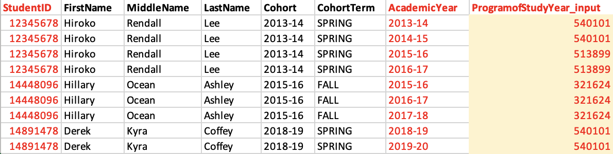

# PDP Toolkit Guidance

This README.md document explains how this toolkit is structured, and provides step by step instructions on how to use it with your PDP data. The [ReportDemo.md](https://github.com/BeaLeydier/researched-pdp-toolkit/blob/main/ReportDemo.md) document serves as an example of what kind of report and analyses you can hope to generate with this toolkit.

## Objective: What is this toolkit about?

The goal of this toolkit is to replicate the [CTE Diagnostics Toolkit](https://github.com/rachworsham/open_sdp_cte_toolkit) of the [OpenSDP](https://opensdp.github.io/) project, using your institution's PDP [Analysis-Ready Files](https://help.studentclearinghouse.org/pdp/knowledge-base/using-the-analysis-ready-file.s/). It uses Stata to transform and analyze the data, and generates tables and figures for your analysis.

This toolkit contains code and instructions to
- transform your PDP Analysis-Ready Files into the appropriate data structure for our analysis purpose; we will call this step "Make Data"
- use these transformed datasets to create relevant graphs and tables featured in the [CTE Toolkit](https://github.com/rachworsham/open_sdp_cte_toolkit); we will call this step "Make Report"

Given the PDP Analysis-Ready Files follow a standardized, predictable format, the code is meant to be as close to plug-and-play as possible. This readme provides instructions on how to set up the toolkit with your own data and parameters, and where to adjust the code if needed.

Because the PDP Analyis-Ready Files at this time unfortunately do not contain information about students pathways, which is a core dimension of the CTE Diagnostic, this toolkit also includes a data entry step, aimed at merging student pathway information with information from your PDP Analysis-Ready Files; we will call this step "Enter Data". This readme provides instructions on how to enter and label your student pathway data before running the analyses.

## Contents: What kind of analyses and insights can I expect from this toolkit?

This repository contains an example of the graphs and tables generated by this toolkit in the [ReportDemo.md](https://github.com/BeaLeydier/researched-pdp-toolkit/blob/main/ReportDemo.md). The sections of the report mirror those of the CTE toolkit. It also adds a few dimensions for the analysis, leveraging the specificity and richness of the data available in the PDP Analysis-Ready Files.

Specifically, the sections are 

- Section 0 : Describing Your Data 
    Note that this section was mentioned in the CTE toolkit but its code was not included in the CTE toolkit data files. The current toolkit provides code for some example summary statistics you may want to generate to describe your data.

- Section 1 : Completion
    This section contains two sub-section : Completion by Pathway and Completion by Credential Sought.
        The Completion by Pathway subsection is analogous to the CTE toolkit's Section 1, and focuses on student completion outcomes by pathway.
        The Completion by Credential Sought subsection is an addition compared to the CTE toolkit. It follows the same logic as the previous subsection, but analyzes data by credential sought instead of pathway, leveraging the fact that the PDP Analysis Ready files contain information on credential at entry.

- Section 2 : Mapping Student Progression
    This section contains two subsections : Pathways Over Time and Short-Term Outcomes.
         The Pathways Over Time subsection is analogous to the CTE toolkit's Section 2, and looks at student outcomes by pathway over time. One key difference with the CTE toolkit is that, because the PDP Analysis Ready Files contain year-level outcome data instead of term-level outcome data, the graphs in this unit display progression year by year, instead of term by term.
        The Short-Term Outcomes subsection focuses on Year 2 outcomes available in the PDP Analysis Ready File : Retention and Persistence. It contains similar analyses as those in Section 1, but focused on these two short term outcomes, instead of the final Completion outcomes.

- Section 3 : Gate-Keeper Courses
    This section is analogous to the CTE toolkit's section 3, and looks at gate-keeper courses in each pathways.

- Section 4 : Credit Accumulation
    This section is analogous to the CTE toolkit's sectoin 4, and looks at credit accumulation over time. 

## Getting Started: How do I get the toolkit?

If you are familiar with github, you can fork this repository, and clone it to your local machine.

If you are not familiar with github, you can simply download this repository, and save it anywhere convenient on your local machine. For that, click on the green "<> Code" button and select "Download ZIP". Then, navigate to the working directory on your local machine where you want this toolkit to be saved, and save the repository there. It will be saved as a .zip file, which is a compressed folder containing all the files and subfolders of this repository. You will need to [unzip](https://www.wikihow.com/Unzip-a-File) it.

Whether you fork/clone or download the repository, it is important to keep the folder and subfolder structure intact, as well as keep the existing files and folder names as they are. The code of the toolkit is written with those in mind, and modifying them will require more customization of the existing code before you can run it. While we strongly advise against deleting or renaming existing folders or files, you will need to add new files to the existing toolkit, inside the appropriate subfolders, as you start working on it.

## Workflow: How will this work ?

You will first download the toolkit and save its contents to your own machine, so you can run it on your own data.

You will then copy and save the following data files to your toolkit folder on your local machine, inside the dedicated subfolders of the toolkit 
- Your PDP Analysis Ready Files under 1_data-pdp
- Your student pathway information under 2_data-toolkit

The AR files are already standardized and formatted, and you can get help on how to find them [here](https://tinyurl.com/ARFILEPLEASE). 

The student pathway information is not standardized, and this toolkit contains scripts and templates to help you extract, format and label the student pathway information in a way that will make it easy to integrate it with the rest of the PDP data used in this toolkit. This toolkit also contains some diagnostics for you to run, checking for some possible discrepancies between your PDP AR files and the student pathway information you are providing. 

The set up and data definition steps will only be done once and for all. From there onward, the analysis starts.

Once you have added your data to the appropriate toolkit subfolders, you can run the toolkit analyses to create an analytical report. The toolkit analyses rely on certain parameters and custom choices that will be specific to your institution, which you can define once at the beginning of the analysis. These include for example defining whether you are a 2-year or a 4-year institution, and what colors you want to use for your graphs. For each of the parameters, the toolkit has defined a default, as well as instructions on how to change this default. You will be able to change these later as well if you want to produce different reports with different parameters.

Once you have defined your analysis parameters, you can run the dofiles (aka scripts) that produce the analyses. The first dofiles will transform, recode, reshape and restructure your data. The next dofiles use the transformed data to produce graphs and tables.

## Overview: How is this toolkit structured?

This toolkit contains files at the root of the repository, as well as subfolders with more files. 

At the root of the repository, we have 
- a .gitignore file : You can ignore (!) this file. It is the file that ensures in the background that none of the files you add in the 1_data-pdp, 2_data-toolkit, 3_data-diagnostics folders are getting tracked by git, so they are never shared with github.
- some dofiles : these dofiles are "master dofiles" and call the other dofiles of the toolkit, to make it easy for you to run a whole portion of the toolkit without having to run each file separately. Each master dofile correspond to one step you have to complete in the toolkit. The master dofiles also contain a lot of comments and instructions on what each step consists of.
- this README.md document
- a ReportDemo.md document, which is an example report that this toolkit generates

The rest of the toolkit files are organized in subfolders as follows 

0_scripts contains all of the scripts of the toolkits, including a custom ado subfolder defining custom colors for the toolkit graphs
1_data-pdp is where you will add your PDP AR files 
2_data-toolkit is where the pathway data entry templates will be created, and where you will add your student pathway information
3_data-diagnostics is where any data diagnostics you choose to run on the pathway data entry will get exported 
4_output is where all the graphs and tables of the analysis will get exported

## Customization: What will you need to update before being able to run the code ?

While this toolkit is meant to be as plug-and-play as possible, you will need to customize it to make it fit your needs and your data. There are a few ways in which you will need to update and customize it

1. Before working on the toolkit, you will need to run the 0.0.Set-Up file that installs custom user written commands in Stata required for this toolkit, as well as custom colors used in the graphs.
1. You will need to add your data (PDP and pathway data) in the appropriate subfolders, and
    - add your PDP data file name to the 1.1.Add-PDP-Data.do dofile
    - add your pathway data and pathway label files name to the 2.3.Add-Pathway-Data.do dofile
1. At the top of every dofile you run, you will need to define your machine-specific filepath, following the example provided in each dofile in the Set Up section
1. Before running any analysis, you will need to define your institution's parameters, like whether you are a 2-year or 4-year institution, and how many credits are considered "completed" for a degree, in the dofile 3.Define-Institution-Parameters.
1. Inside any dofile you run, you will need to update the code everywhere there is a comment that says INSTRUCTIONS. This may include updating a file name or a file path, changing a variable name, or other customizations.
1. Inside any dofile you run, you may need to make additional changes to the code if you run into any errors due to data types or file types being inconsistent. Each dofile contains ample documentation explaining what the code aims to do, as well as suggestions for checks and possible alternative code in case of common errors. 

## Step by Step : Using the Toolkit

All the steps 0 to 2 are done just once and for all, before you can start transforming data and creating analyses. Steps 3 to 5 are the ones producing the analysis, once the toolkit is set and the data uploaded.

### Step 0. Set Up

Open and run the 0.0.Set-Up.do dofile at the top of the repository to customize some important Stata-specific commands and paramaters. This step only needs to be done once, before anything else.

Start by adding your machine-specific file path at the top (like you will in every dofile), and you will be able to run the dofile.

The dofile does two things :

1. Installs the custom user-written commands you will need to run this toolkit. It is necessary for you to run this part of the dofile to ensure the rest of the toolkit runs smoothly.

1. Defines custom colors for the toolkit graphs. This section is only for your information and doesn't need to be run nor changed if you do not wish to change the default colors we have defined for the graphs.
        We have created dedicated color files (.style files), and saved them under the 0_scripts folder in an ado subfolder.
        This dofile adds the custom ado filepath to the ado filepaths recognized by your Stata, in order to add these custom colors to your Stata repertoire. That step is repeated in every dofile that exports a graph, to ensure the colors are always recognized by Stata locally.
        This file also prints the color palette in a graph for you to see the custom colors, as shown below. You can use this same graph exporting feature if creating your own custom color palette. 
        If you want to change these custom colors, we have included instructions in the dofile on how to update the .style files accordingly.
        If you do not need to change the custom colors, nothing is required from you in 

### Step 1. Add PDP Data 

Find your PDP Analysis Ready (AR) Files, copy and save them under the 1_data-pdp subfolder of this toolkit. For this toolkit, we are only using the AR Cohort file and the AR Course file, so you only need to copy these two in that folder. If you need help finding your PDP AR files, you can go [here](https://tinyurl.com/ARFILEPLEASE).

Once that is done, add your PDP AR file names to the 1.1.Add-PDP-Data.do dofile, where the globals are being defined. It is important for these names to be updated at this stage, as the next dofiles (from step 2 onward) will refer to them. 

### Step 2. Add Pathway Data 

Unlike the rest of the PDP data, student pathway is not systematically entered on a year-by-year basis in the AR files. In order to run pathway-level analysis, you then need to add pathway data to this toolkit. In order to make it easier, this toolkit creates two templates, based on your data, to help you enter your pathway data as well as label pathways. 

Start by running the 2.1.Create-Pathway-Data-Entry-Template.do dofile : this creates two templates, at the Year and the Term level, for you to enter student pathway data for all students present in your PDP AR files. The template look like the image below. You do not have to use the Excel template generated by this dofile, but you need to provide a file with the student pathway information formatted this way and save it under 2_data-toolkit.

Then, open and run the 2.2.Create-Pathway-Labeling-Tempalte.do dofile : this creates a template for you to label your pathways, so that graphs do not display program codes but pathway names. In order for this file to run, you will need to add the name of your own student pathway data file (which you just created and added to 2_data-toolkit) on line 89.

Finally, open and run the 2.3.Add-Pathway-Data.do dofile : this script defines the file names for your pathway data files as globals, analogous to the 1.1.Add-PDP-Data.do dofile, which ensures they are correctly being read by the toolkit in subsequent scripts.

### Step 3. Define Institution Parameters

In this dofile, you will define 

1. Whether your institution is 2-year or 4-year
1. How many credits constitute a "complete" degree

These two parameters are defined as globals here and used later on in the analysis. You can change these parameters later on, and run again the analysis, if you want to produce multiple reports with different parameters.

### Step 4. Make Data

You can now transform your data into the appropriate data frames that will allow you to produce graphs and tables for your report.

The dofile 4.Make-Data.do lists and runs all the dofile that produce a data frame for each of the sections of the report. They need to be run in order, as subsequent sections can rely on the dataframes of earlier sections. Each section specific dofile creates a section specific dataframe, which is exported as a .dta under 2_data-toolkit. You do not have to run them all at once, and you are welcome to open each individual files from the 0_scripts folder to run them and customize them.

Some data construction scripts also create data diagnostics, to ensure there are no discrepancies between your entered pathway data and the PDP data. These diagnostic results get exported into 3_data-diagnostics.

### Step 5. Make Report

Finally, you can run the analytical files of the toolkit. These use the dataframes created in Step 4, and export graphs and tables under 4_output. The dofiles contain example code for different graphs, but more can be added depending on the analytical dimensions of interest. 

The ReportDemo.md provides an example of how to integrate the graphs into a narrative document. 