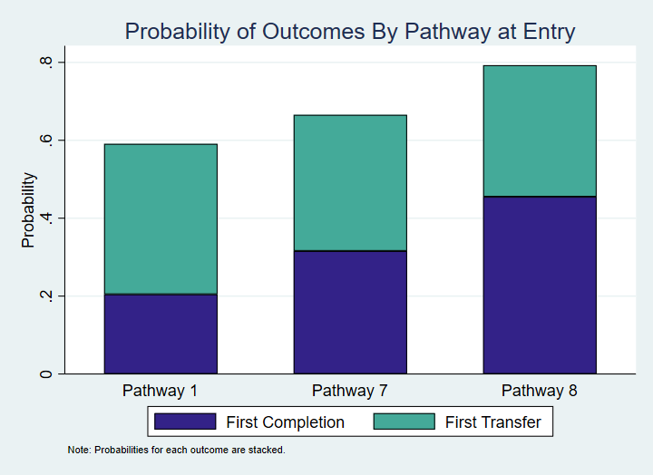

# PDP Toolkit

This report serves as both documentation and a mock example of a report you can generate with this toolkit. 

## Section 1 : Completion

### Completion by Pathway

#### Overall

#### By Term1 GPA and other covariates

#### By Age at Entry

### Completion by Credential Sought

#### By Term1 GPA and race

## Section 2 : Mapping Student Progression 

### Pathways Over Time

### Short-Term Outcomes

## Section 3 : Gate-Keeper Courses 

## Section 4 : Credit Accumulation