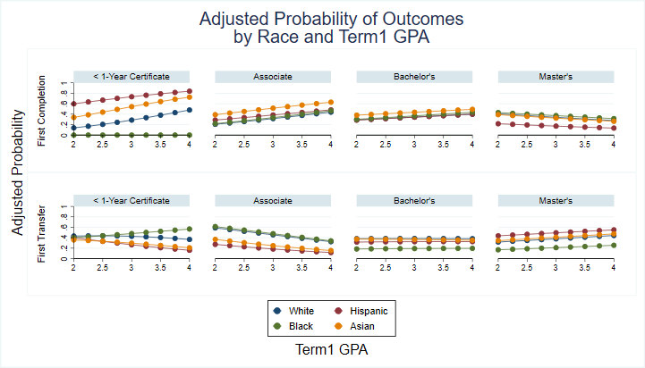

# PDP Toolkit Guidance

This readme document serves as both documentation and a mock example of a report you can generate with this toolkit. 

## Getting your data ready 

Insert detailed instructions on 
- Pathway data entry
- Workflow of dofiles
- Data prep code contents

## Reproducing the analysis 

Insert detailed instructions on
- Data analysis code contents
- How to replicate with own data : what to download, what to change where
- How to generate markdown doc

## Data diagnostics

Before digging into the data, we recommend running some diagnostics, especially on missing values. 
- Diagnostics/flags code content

# PDP Toolkit Demo

## Section 0 : Descriptive Statistics

## Section 1 : Completion

### Completion by Pathway

#### Overall

#### By Term1 GPA and other covariates

#### By Age at Entry

### Completion by Credential Sought

#### By Term1 GPA and race

## Section 2 : Mapping Student Progression 

### Pathways Over Time

### Short-Term Outcomes

## Section 3 : Gate-Keeper Courses 

## Section 4 : Credit Accumulation