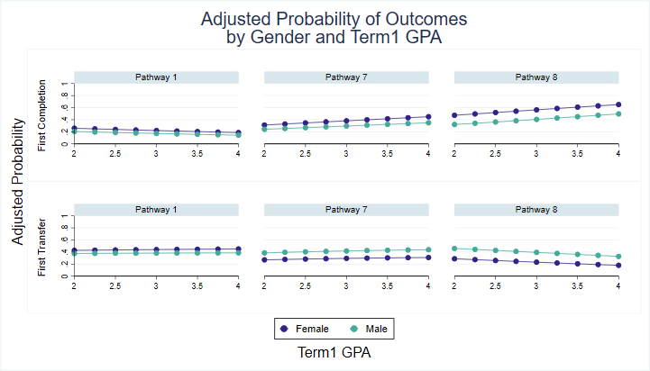
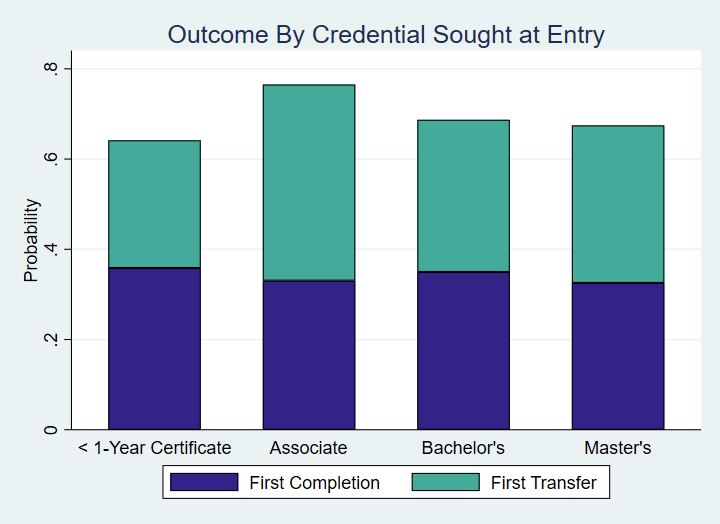

# PDP Toolkit Demo

This is an example report with sample graphs and analyses produced by the toolkit.

## Section 0 : Descriptive Statistics

You can explore your data and create summary statistics to understand your student population first.

This chart, for example, shows how the credentials students attempt at entry are distributed by race. It gives you an idea of both the racial composition and the credential choices of your student population.

You can do similar cross-tabulating bar charts on other dimensions. 

## Section 1 : Completion

### Completion by Pathway

#### Overall

This chart shows the probability that a student will have a successful outcome, conditional on their pathway of entry. We see differences across pathway. 

This chart shows how two students, who are the same on all observed characteristics, have differing probabilities of success based on which pathway they choose to enroll in.

#### By Term1 GPA and other covariates

This chart shows how students’ probability of success changes at different levels of Term1 GPA, for different pathways.

This chart shows how students’ probability of success changes at different levels of Term1 GPA, for different pathways, disaggregated by gender.

This chart shows how students’ probability of success changes at different levels of Term1 GPA, for different pathways, disaggregated by first generation status.

This chart shows how students’ probability of success changes at different levels of Term1 GPA, for different pathways, disaggregated by race.

#### By Age at Entry

This chart shows how students’ probability of success changes at different levels of age at entry, for different pathways.

### Completion by Credential Sought

This chart shows the probability that a student will have a successful outcome, conditional on their credential at entry. We see differences across pathway. 

#### By Term1 GPA and race

This chart shows how students’ probability of success changes at different levels of Term1 GPA, for credentials at entry, disaggregated by race.

## Section 2 : Mapping Student Progression 

### Pathways Over Time

This chart shows how students transition between pathways and into different oucomes over years. Each of the vertical line represents the start of an year - from their initial enrollment to the end of their fourth year. The numbers in the vertical lines correspond to the enrollment numbers in each path.

### Short-Term Outcomes

This chart shows the probability that a student will have a given year 2 outcome (persistence or retention), conditional on their pathway of entry. We see differences across pathway. 

This chart shows how two students, who are the same on all observed characteristics, have differing probabilities of year 2 success based on which pathway they choose to enroll in.

## Section 3 : Gate-Keeper Courses 

This chart shows the extent to which students in the a pathway X may be impeded by gatekeeper courses. 

In the scatterplot, courses on the left side are courses that have a higher failure rate in the first attempt (the x-axis represents the failure rate). Courses at the top of the scatter plot are courses that are bigger predictors of success in that pathway (the y-axis represents predicted probability of completion). The size of the dots corresponds to the number of students enrolled in the course, giving an idea of how many students may be impacted by a given course. Finally, courses are color-coded by their Gateway status. 

This chart is the same as above, but with course labels instead of course weights by student size. This allows you to see which course specifically could be a gatekeeper course in a pathway.

## Section 4 : Credit Accumulation

This chart shows the difference betweeen how many credits students attempt, earn and should ideally earn to complete on time.

